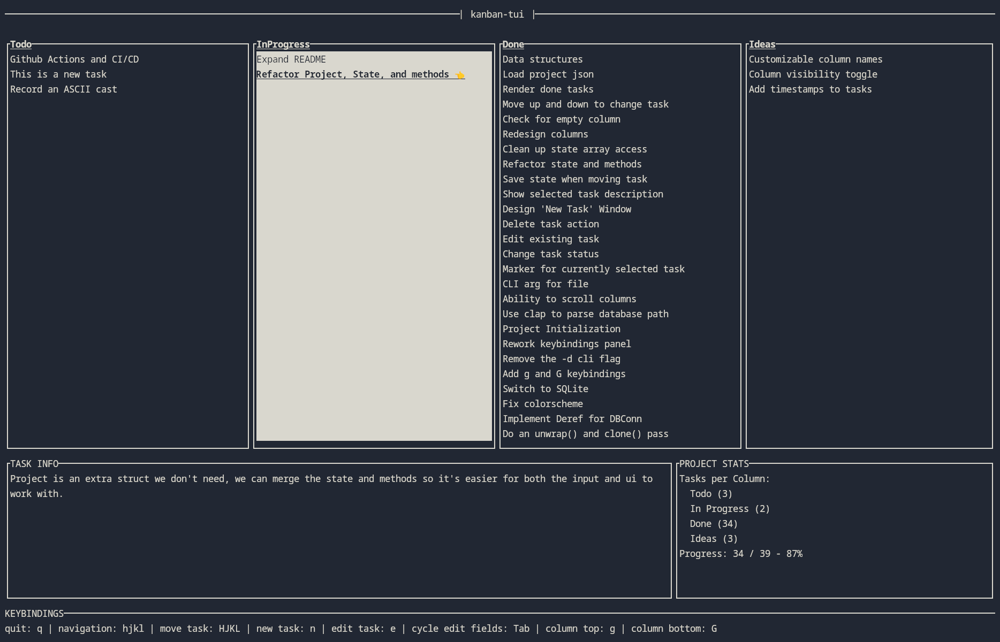

#-*- mode: org -*-

# kanban-tui

## About

kanban-tui is a lightweight, minimalist, terminal-based [Kanban](https://en.wikipedia.org/wiki/Kanban_board) tool built in
Rust. Keybindings are vim-like, making it pretty fast to navigate and handle
tasks. Currently it's not that feature-rich, but it provides all the essential
functionality you need to manage tasks in the classic Kanban way.

It uses [ratatui](https://crates.io/crates/ratatui) for the TUI interface rendering and [rusqlite](https://crates.io/crates/rusqlite) for data
persistence. Both awesome crates to work with.

## Motivation

Decided to make kanban-tui to work on a non-trivial Rust application. I enjoy
TUIs for their simplicity and efficiency. I don't really plan on using this, as
I'm an [org](https://orgmode.org/) person myself, but if someone actually decides they like this level
of minimalism, then I might consider working on it more.

## Features

-   Terminal-based: Enjoy the simplicity and speed of a text-based interface
-   Vim-like keybindings: For those who have `hjkl` burned into their skull
-   SQLite backed: Overkill maybe? At least I like SQL
-   No bloat: Just create a task and move it around

## Showcase

## Building and Installing

To build and install kanban-tui, follow these steps:

-   Install Rust: If you don't have Rust installed, you can get it from [here](https://www.rust-lang.org/tools/install).
-   Clone this repository, cd into it
-   Build the project: `cargo build --release`
-   The built binary can be found in `target/release/kanban-tui`
-   Optionally, you can move the binary to a directory in your `$PATH` for easier
    access.

## Usage

It is recommended to run `kanban-tui` from the root of your project so it can
pick up the project's name. This automatically creates a SQLite database there
named `kanban.db`.

If you prefer a different name for the database file, you can specify the file
name when running the app, like `kanban-tui todos.kanban` as an example.

Once open, start creating tasks, then move them across columns to track their
status - from "To Do", through "In Progress", to "Done". All task and navigation
operations are performed through simple keybindings.

## Keybindings

-   Quit: `q`
-   Navigation: `hjkl`
-   Move Task: `HJKL`
-   New Task: `n`
-   Edit Task: `e`
-   Cycle Form Fields: `Tab`
-   Column Top: `g`
-   Column Bottom: `G`

## Potential Future Features

-   Timestamps for tasks (created, moved, completed)
-   Customizable column (name, amount, etc;)
-   More project stats (velocity, avg time to complete)
-   Column visibility toggle (hide "Ideas")
-   Attach images (using [Kitty Term Image Protocol](https://sw.kovidgoyal.net/kitty/graphics-protocol/))
-   Read from other backends (Trello, Jira, etc;)
-   Copy task
-   Reports
-   Export to other formats

## Acknolwedgements

[Karrq](https://github.com/Karrq) was nice enough to provide some help from time to time and even
contributed a handy little macro.

## Contributions

While the project is primarily developed to practice Rust, if for some reason
you like this and want to contribute, open an issue and we can discuss whatever.

## License

kanban-tui is licensed under the terms of the MIT license. For more information,
see the included LICENSE file.

